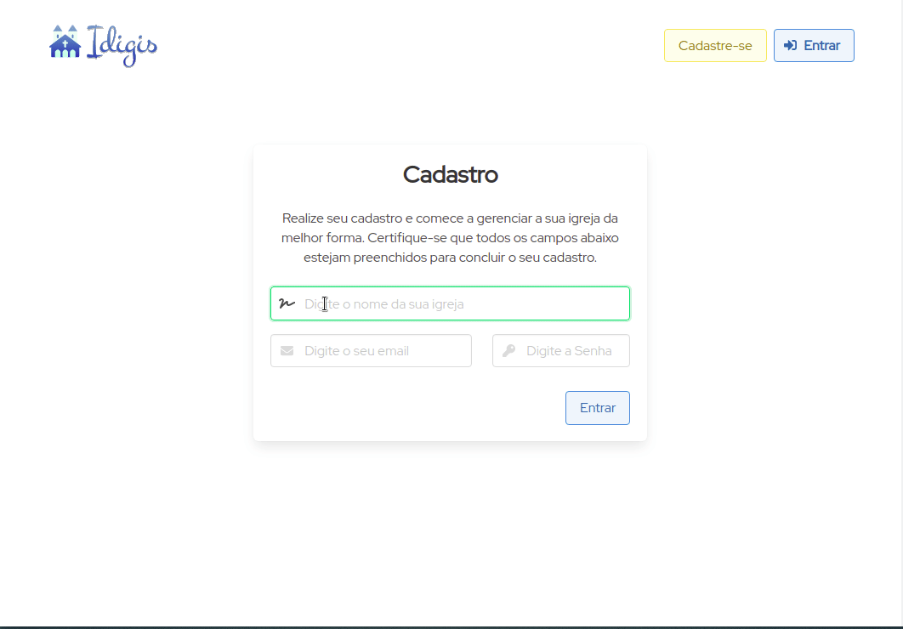

  

<h3 align="center">
Gestão de igrejas de forma simples e prática
</h3>

  

  

  

### ✌ Olá!

[Idigis](https://idigis.herokuapp.com) é um sistema de gestão de igrejas escrito em C# e Blazor, com práticas de TDD e Arquitetura Limpa. Ele entrega uma API, que é consumida pelo Blazor WebAssembly e pode ser usada tanto no navegador, quanto no celular, através do PWA (ainda em desenvolvimento).

Esse sistema permite o gerenciamento das principais atividades realizadas em uma comunidade, facilitando a vida dos administradores, como gerenciamento de mebros e gerenciamento financeiro.

### 💬 Como funciona?

Para utilizar a plataforma, basta cadastrar o seu email e senha e pronto! Já pode gerenciar a sua igreja a vontade. como no exemplo abaixo:

  

### ✨ Objetivos

Este é um projeto em construção e tem código aberto, sintam-se livres para abrirem *issues* e *pr's* quando quiser. Meu objetivo é que ele evolua e consiga ajudar a muitas igrejas que tem dificuldade de gerenciar seus recursos e pessoas, e que agora podem mesmo que do seu smartphone ter essa gerência simplificada.